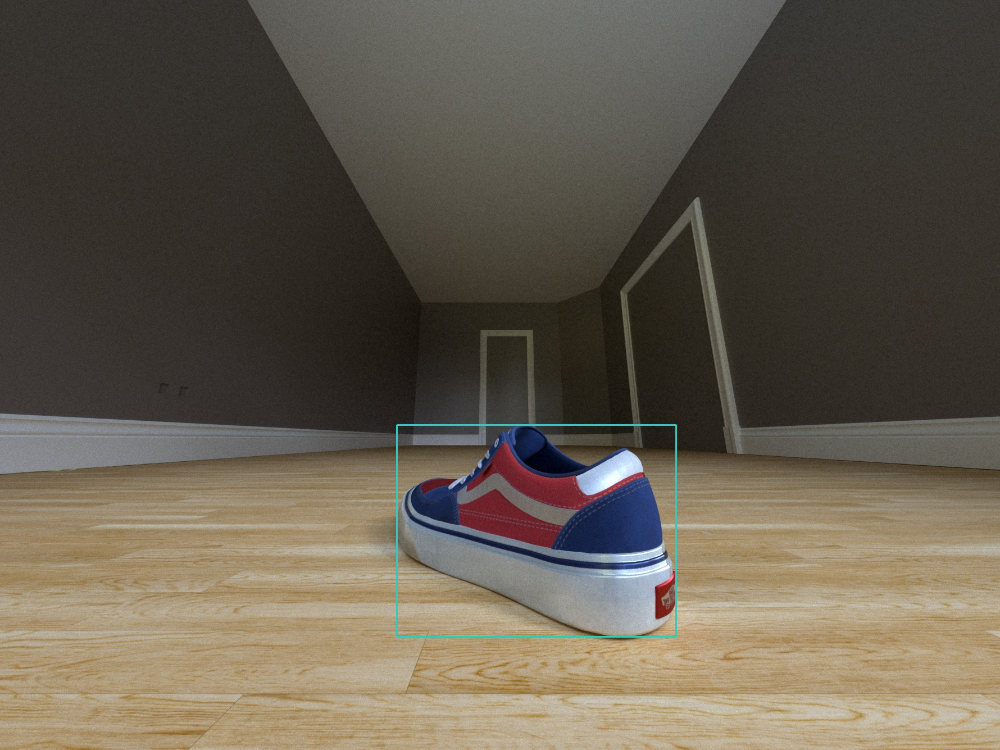

# synthesis-bbox-room-api
Creates 2D bounding boxes for objects in renders of the Room API

## Install
The script requires Python 3. Install the requirements with:

```bash
pip install -r requirements.txt
```

# Usage
The script needs RGB images, the masks of objects and the json files with information about objects in the scene.
Running the script will output a json with 2D bounding boxes and other information for all objects in a scene. 
Optionally, it can also output a visualization of the bounding boxes.

```bash
python create_2d_bbox_room_api.py \
--src_dir images \
--dst_dir images \
--debug_viz_bbox_mask
```



The output json contains a list of dicts, each of which contains information about an object in the scene.
Explanation of the parameters:
- `bounding-box-2d`: The 2D bounding box's coordinates are contained in the parameter
- `position`: 3D world coordinates of the object
- `type`: Type of the object
- `bounding-box`: World coordinates of 3D axis-aligned bounding box for the object
- `mask_id`: ID of the object in the mask

```json
{
    "objects": [
        {
            "position": [
                0.0033083446323871613,
                0.06210047006607056,
                -1.9902055263519287
            ],
            "type": "shoes",
            "bounding-box": {
                "max": [
                    0.12173030525445938,
                    0.12344677746295929,
                    -1.86541748046875
                ],
                "min": [
                    -0.11511361598968506,
                    0.0007541626691818237,
                    -2.1149935722351074
                ]
            },
            "mask_id": 2,
            "bounding-box-2d": {
                "x_min": 706,
                "x_max": 1203,
                "y_min": 756,
                "y_max": 1133
            }
        }
    ]
}
```
